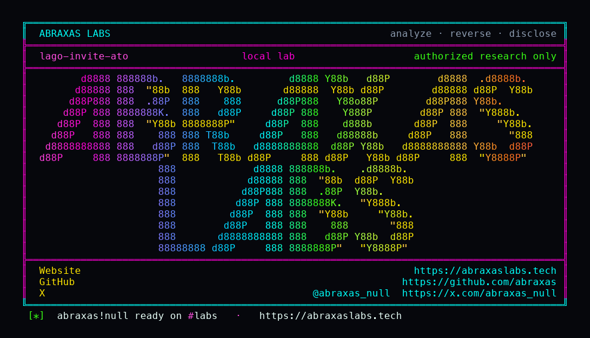

<p align="center">
  
</p>

<p align="center">
  <a href="https://abraxaslabs.tech"><strong>abraxaslabs.tech</strong></a>
  &nbsp;·&nbsp;
  <a href="https://github.com/abraxas">github.com/abraxas</a>
  &nbsp;·&nbsp;
  <a href="https://x.com/abraxas_null">@abraxas_null</a>
  &nbsp;·&nbsp;
  <a href="mailto:abraxas.null@proton.me">abraxas.null@proton.me</a>
  &nbsp;·&nbsp;
  <a href="https://github.com/abraxas/lago-invite-ato">lago-invite-ato</a>
</p>

# lago-invite-ato

**Lago** `v1.53.0` - GetLago

[`Mutations::Invites::Accept`](https://github.com/getlago/lago-api/blob/v1.53.0/app/graphql/mutations/invites/accept.rb) has no `AuthenticableApiUser`. Create/revoke do. Accept does not. [`register_from_invite`](https://github.com/getlago/lago-api/blob/v1.53.0/app/services/users_service.rb) loads the user by invite email. If that account already has memberships, the posted password is discarded. `AuthToken.encode(user:)` still runs. The JWT is **user-scoped**. No org claim. The client sends `x-lago-organization` for whichever org that user already belongs to. Including the victim's. `createInvite` already returns the token to the inviter.

**Invite `cfo@victim` into a throwaway org, accept it yourself, and you are that person on every org that email already sits in. Mailbox never involved. Victim password unchanged.**

| | |
|---|---|
| ID | no CVE yet |
| CWE | [CWE-287](https://cwe.mitre.org/data/definitions/287.html), [CWE-306](https://cwe.mitre.org/data/definitions/306.html) |
| CVSS | **Critical: 9.6** `CVSS:3.1/AV:N/AC:L/PR:L/UI:N/S:C/C:H/I:H/A:N` |
| Product | [Lago](https://github.com/getlago/lago) / [lago-api](https://github.com/getlago/lago-api) |
| Affected | through **v1.53.0** email/password acceptInvite |
| Auth | org admin (`organization:members:create`); Cloud signup is enough |
| License | [GNU Affero GPL v3.0](LICENSE) |
| Lab | `127.0.0.1` only |

## What an attacker can do

You need an org you control. Cloud signup is enough (`LAGO_DISABLE_SIGNUP` defaults false). Invite a victim email, accept unauthenticated with a dummy password, then header-switch to Victim Corp. Invoices, API keys, Stripe, wallets.

Not a random visitor with no account. Not a password reset. Dummy login fails. Real victim password still works. Google/Okta accept binds IdP email and is not this bug. Single-org self-host with nobody else's email in the DB does not give you another merchant. Same database, two orgs, same email: it does.

Same tree as the [Stripe one-time invoice IDOR](https://github.com/abraxas/lago-stripe-invoice-idor). Different bug.

## How I found it

I read `Accept` (no `AuthenticableApiUser`), then `find_or_initialize_by(email:)`, then the memberships-present branch that skips the password, then `AuthToken.encode(user:)`. Then Google accept, which **does** check `google_oidc["email"] == invite.email`. Email/password accept does not bind the password of an existing user.

The first client that looks at this will invite an unused address, accept it, and get a brand-new Lago user with the password they posted. That is the feature. The witness is the **existing** victim user id coming back.

Wrong turns already recorded: accepting with Google/Okta; treating `createInvite` 401 without a JWT as the whole story (create is authenticated, accept is not); looking only at the attacker org on `currentUser` (the tell is **Victim Corp** in the list); dummy password logging in (that would mean the hash was overwritten - lab asserts it was not); a reverse shell. Theatre. No inbox.

Then: two `registerUser` calls plant Victim Corp and Attacker Corp. Fresh emails each run so a dirty volume does not 422 `user_already_exists`. `createInvite` on the victim email. Unauthenticated `acceptInvite` with a dummy password. Returned user id matches the victim. `currentUser.organizations` lists both. Header switch returns Victim Corp.

## Lab

```bash
cd lab
./run.sh
```

Target **only** `http://127.0.0.1:13000`. Stripe IDOR used **13001**. No UI port.

```text
IOC victim_password_unchanged
IOC victim_real_password_still_works
SUCCESS LAGO-INVITE-ATO acceptInvite JWT is existing victim; lists Victim Corp; no inbox
```

## The fix

If the user already exists, require they authenticate as themselves (or prove mailbox / IdP) before attaching the membership. Do not mint a JWT for an existing user from unauthenticated accept. Stop returning invite `token` to the inviter if it is a capability.

## References

- [github.com/getlago/lago](https://github.com/getlago/lago) tag [v1.53.0](https://github.com/getlago/lago/releases/tag/v1.53.0) · [lago-api](https://github.com/getlago/lago-api)
- [`accept.rb`](https://github.com/getlago/lago-api/blob/v1.53.0/app/graphql/mutations/invites/accept.rb) · [`accept_service.rb`](https://github.com/getlago/lago-api/blob/v1.53.0/app/services/invites/accept_service.rb) · [`users_service.rb`](https://github.com/getlago/lago-api/blob/v1.53.0/app/services/users_service.rb) · [`create.rb`](https://github.com/getlago/lago-api/blob/v1.53.0/app/graphql/mutations/invites/create.rb) · [`object.rb`](https://github.com/getlago/lago-api/blob/v1.53.0/app/graphql/types/invites/object.rb) · [`google_service.rb`](https://github.com/getlago/lago-api/blob/v1.53.0/app/services/auth/google_service.rb)
- Same product: [lago-stripe-invoice-idor](https://github.com/abraxas/lago-stripe-invoice-idor)
- [CWE-287](https://cwe.mitre.org/data/definitions/287.html) · [CWE-306](https://cwe.mitre.org/data/definitions/306.html)

## License

GNU Affero GPL v3.0. See [LICENSE](LICENSE). Loopback lab only. No warranty.
